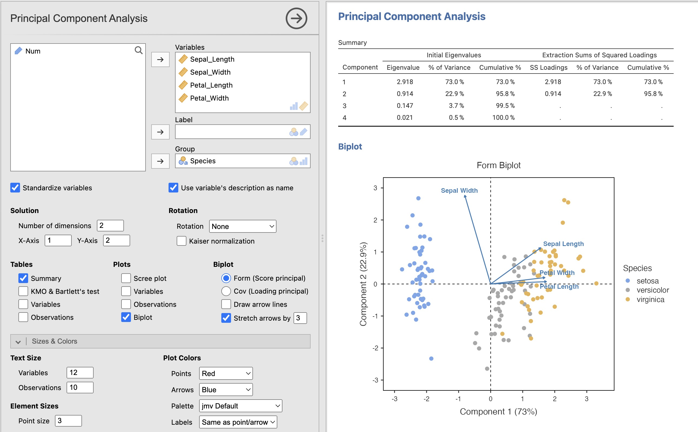
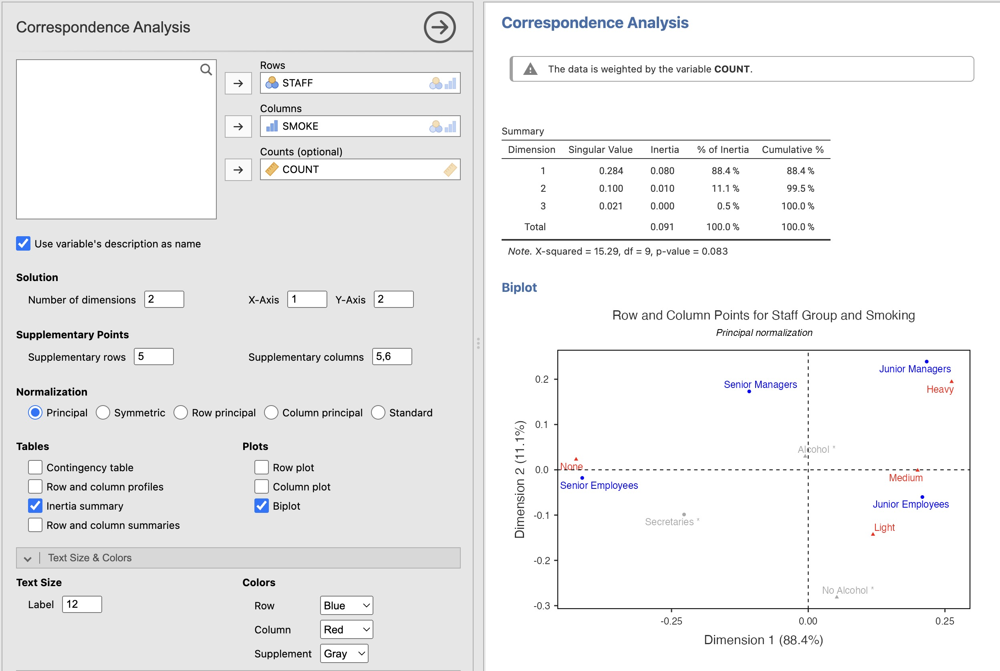
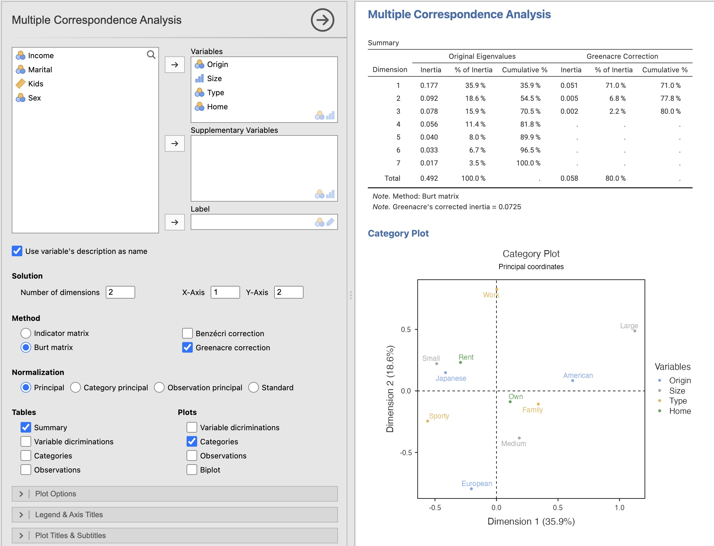

# vijMulti

A [jamovi](https://www.jamovi.org) module offering the **main classic multivariate data analyses**: 

- Principal Component Analysis
- Correspondence Analysis
- Multiple Correspondence Analysis

The module is available in the **Analyses** tab.

## Principal Component Analysis

## Correspondence Analysis

## Multiple Correspondence Analysis

## Last changes: vijMulti 1.0.0 (2026-09-13)

* The three analyses PCA, CA and MCA have been moved from vijPlots to this new module
* MCA (Burt method): Fixed variable discrimination computation
* Two new color palettes based on the Carbon Design System (Carbon:Dark, Carbon:Light)
* Improved ggplot2 4.0 support
* Improved error handling
* Code optimization and fixes

## References

- Bernaards, C., Gilbert, P., Jennrich, R. (2026), GPArotation: Gradient Projection Factor Rotation. R package version 2026.4.1, <https://cran.r-project.org/package=GPArotation>
- Greenacre, M. (2010), Biplots in Practice, Fundación BBVA. <https://www.fbbva.es/en/publicaciones/biplots-in-practice-7/>
- Husson, F., Josse, J., Le, S., Mazet, J. (2026). FactoMineR: Multivariate Exploratory Data Analysis and Data Mining. R package version 2.14, <https://cran.r-project.org/package=FactoMineR>
- Engler, J.B. (2026). tidyplots: Tidy Plots for Scientific Papers, R package version 0.4.0, <https://CRAN.R-project.org/package=tidyplots>
- IBM. Carbon Design System — Color palettes. <https://carbondesignsystem.com/data-visualization/color-palettes/>

