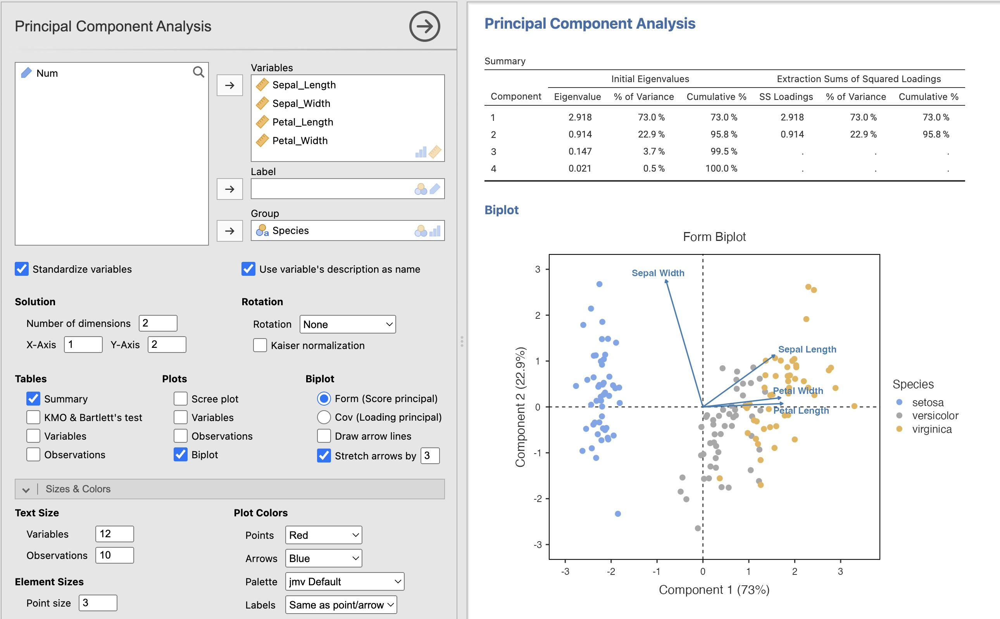
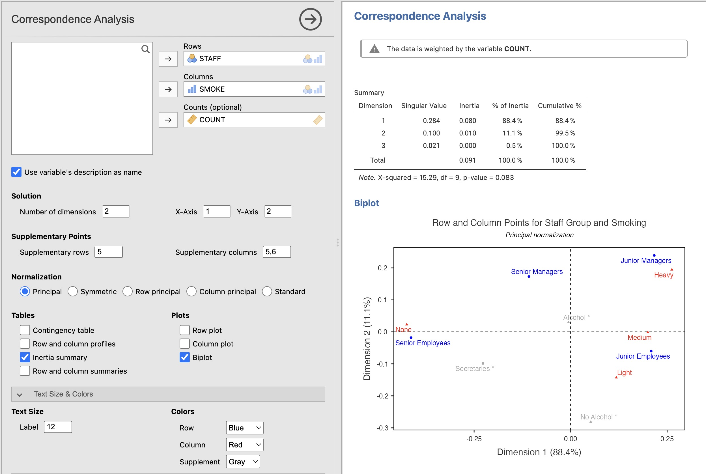
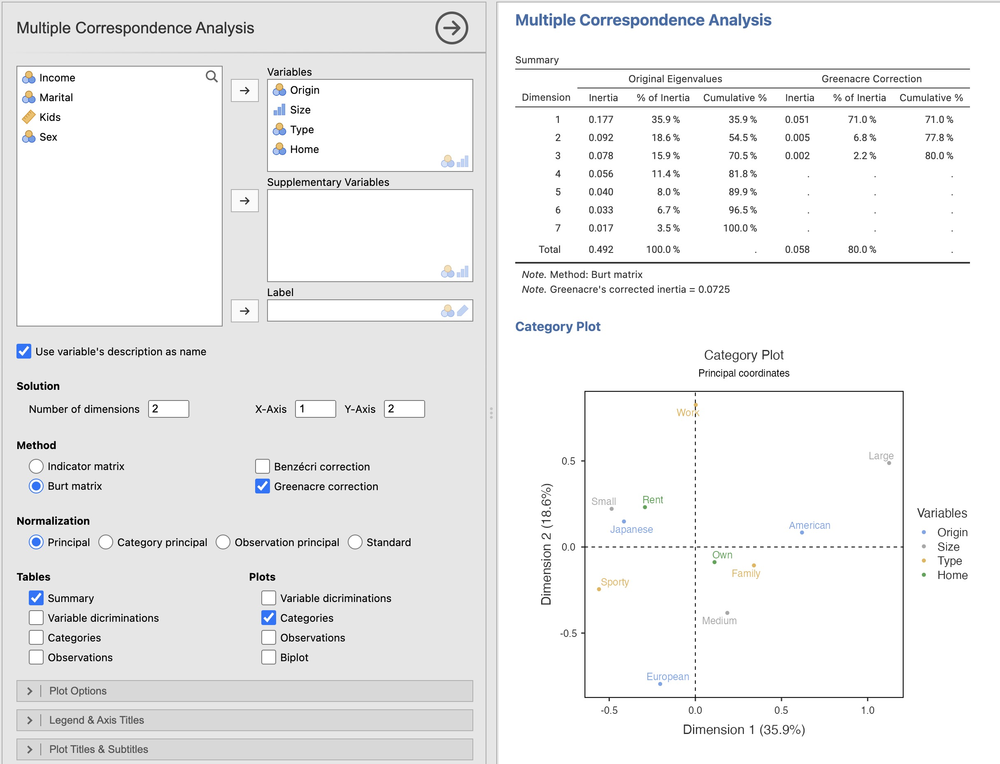

# vijMulti

A [jamovi](https://www.jamovi.org) module offering the **main classic multivariate data analyses**: 

- Principal Component Analysis
- Correspondence Analysis
- Multiple Correspondence Analysis

The module is available in the **Analyses** tab.

## Principal Component Analysis

## Correspondence Analysis

## Multiple Correspondence Analysis

## Last changes: vijMulti 1.1.0 (2026-10-09)

* CA/MCA computations are now based on Greenacre's ca package
* CA: Improved handling of supplementary points in profile tables (SAS-like)
* MCA: Analysis now possible with only two variables
* Some ggsci color palettes added

## References

- Bernaards, C., Gilbert, P., Jennrich, R. (2026), GPArotation: Gradient Projection Factor Rotation. R package version 2026.4.1, <https://cran.r-project.org/package=GPArotation>
- Greenacre, M. (2010), Biplots in Practice, Fundación BBVA. <https://www.fbbva.es/en/publicaciones/biplots-in-practice-7/>
- Husson, F., Josse, J., Le, S., Mazet, J. (2026). FactoMineR: Multivariate Exploratory Data Analysis and Data Mining. R package version 2.14, <https://cran.r-project.org/package=FactoMineR>
- Engler, J.B. (2026). tidyplots: Tidy Plots for Scientific Papers, <https://tidyplots.org>
- Nan Xiao (2026). ggsci: Scientific Journal and Sci-Fi Themed Color Palettes, <https://nanx.me/ggsci/>
- IBM. Carbon Design System — Color palettes. <https://carbondesignsystem.com/data-visualization/color-palettes/>

